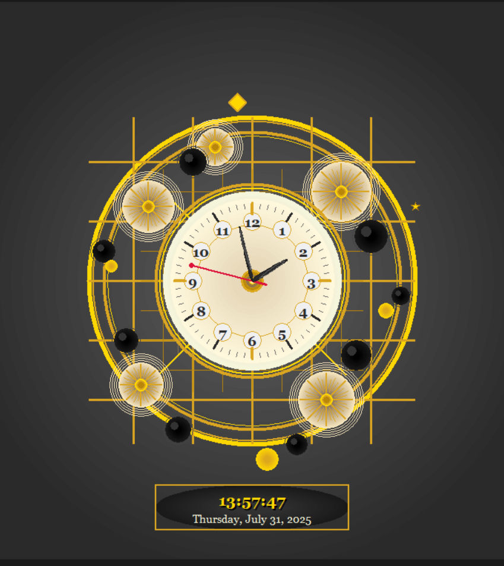
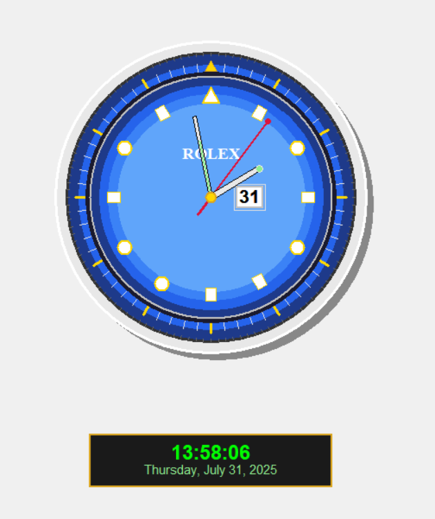

# Analog Clock 🕒

This project is a visually appealing analog clock built using Python and the `tkinter` GUI toolkit.  
It features a real-time moving hour, minute, and second hand—designed to look clean and modern.

## 🛠 Features

- Real-time clock updates
- Smooth second, minute, and hour hand movements
- Aesthetic clock face
- Two design versions: Simple and Luxury

## 🖼 Preview

### 🔹 `analog_clock.py` (Simple Clock)


### 🔸 `luxury_analog_clock.py` (Luxury Clock)


> Make sure the image filenames match (`analog_clock.png`, `luxury_analog_clock.png`) or adjust the paths above.

## 🚀 Getting Started

### Prerequisites

- Python 3.x  
- `tkinter` (usually comes with Python)

### Run

```bash
python analog_clock.py
# or
python luxury_analog_clock.py
